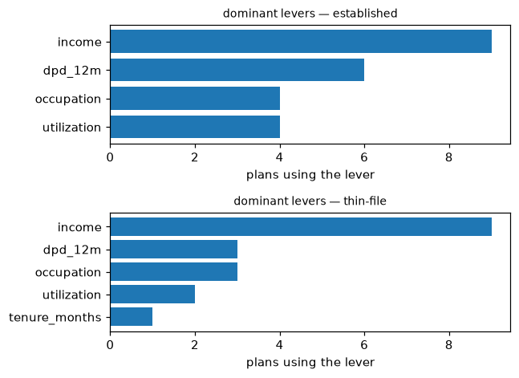

# Auditability

What a validator, an internal auditor, or a supervisor can check without
trusting you, and the call that checks it. Nothing on this page is a new
feature; it is the existing surface arranged around one question: *given
these files, what can I re-derive myself?*

## The artifacts

| Artifact | What it proves | How to verify it |
|---|---|---|
| `Explainer.certificate(x, result, target)` | The full solve, frozen: model fingerprint, constraint fingerprints, target bounds, the plan, its float-verified scores, solver statistics, and — for a region — the certified intervals and category sets | `check_certificate` on the model and constraints the validator was handed; every mismatch is named, never summarized away |
| `check_certificate(cert)` report | `model_match` (the ensemble was not swapped), `constraints_match` (the rule set was not changed), `verification_ok` (the stored plan still routes to the stored score) | Read `mismatches`: one human-readable string per failure; an empty list is the pass |
| `check_certificate(cert, calibrator=...)` | That a calibrated-target plan was solved against *this* calibrator: fingerprint match plus a re-inversion of the stored calibrated bounds against the stored raw interval | Load the calibrator from its own JSON, pass it in ([calibration](../concepts/calibration.md#calibrator-provenance)) |
| `BatchResult.save` / `load` | A portable record of a whole campaign: per-row plans, proofs, seeds, solver statistics, calibrator fingerprints | The file is inert JSON — no pickle, no code execution on load; every 0.x release reads every earlier file ([API stability](../api-stability.md)) |
| `ir_fingerprint(exp.ir)` / `constraints_fingerprint(exp)` | Identity of the parsed model and the compiled constraint set — the same hashes certificates embed | Recompute on the artifact in front of you and compare with what the certificate or report recorded |
| `portfolio_report(batch, groups, explainer=exp)` | One campaign as an artifact: population and proof mix, recourse burden per segment, dominant levers, missing-value transitions, the fingerprints — and, only when asked, framed disparity ratios | The dict is strict JSON; `path=` renders it as one self-contained HTML page (no external references) or as Markdown, so the same numbers travel as a file and as a page |

The chain is short and each link is a hash: the certificate names the model
and constraint fingerprints it was solved under, `check_certificate`
recomputes both and re-verifies the plan, and a batch file carries the same
identifiers row by row.

## A verification session

The realistic hand-off is two files: the model dump and the certificate. The
block below produces that pack and then verifies it the way a reviewer
would — reload, fingerprint-match, re-verify:

```python
# exp, x, target, res: the docs explainer, applicant, target, and solved plan
import json

cert = exp.certificate(x, res, target, seed=0)
stored = json.dumps(cert, allow_nan=False, sort_keys=True)   # file it with the decision

# --- the reviewer's side: the dump file and the certificate ---
report = exp.check_certificate(json.loads(stored))
assert report["model_match"]          # the ensemble was not swapped
assert report["constraints_match"]    # the rule set was not changed
assert report["verification_ok"]      # the stored plan still verifies
assert report["mismatches"] == []
```

In a real review the `Explainer` on the reviewer's side is constructed
independently, from the dump and constraint list the reviewer was handed —
that independence is the point: a certificate checked against the producer's
own in-memory objects proves only self-consistency.

Certificates carry a `schema_version`; the current version stores region
category sets, the previous one is still verified, and an unknown version is
reported as a mismatch rather than guessed at. The compatibility promise is
pinned by committed golden files in CI, not asserted in prose
([API stability](../api-stability.md)).

## Reading a campaign honestly

`recourse_burden_table` and `plot_recourse_burden` summarize a verified
batch by segment — and keep the feasible share and the cost distribution
side by side deliberately: a group's low median cost means nothing without
its feasibility rate next to it, because the median is taken over the plans
that exist, not the people who needed one.


## Report on a portfolio

`treecf.audit.portfolio_report` turns a batch into one document a reviewer
can file: the population counts and the proof mix, the burden table per
segment, the levers each segment's cheapest plans lean on (with the median
move in normalizer units, or the target categories for a categorical lever),
the missing-value transitions those plans ask for, and the model and
constraint fingerprints when the explainer is passed. The returned dict is
the fingerprintable artifact — strict JSON, `portfolio_schema_version: 1`;
`path=` writes it as JSON, or renders it as a single self-contained HTML
page with every figure embedded and no external references, or as Markdown
with the figures beside the file:

```python
# exp, batch: the docs explainer and a batch solved from X_bg
# X_bg: the docs background rows the batch was solved from
from treecf.audit import portfolio_report

groups = ["thin-file" if row[3] < 100 else "established" for row in X_bg[: len(batch)]]
report = portfolio_report(
    batch, groups, explainer=exp, path="portfolio.html", title="Q3 recourse review",
    min_group_size=3,
)
report["population"]                # rows, records, with_recourse, certified/unproven no recourse
report["dominant_levers"]           # per segment: the features the cheapest plans move
report["fingerprints"]              # the same hashes the certificates carry
```



A rendered example is committed as
[a sample page](samples/portfolio_report.html). Disparity ratios — median
burden and no-recourse share against a reference segment — are off by
default (`disparity=True, reference_group=...` turns them on) and every
ratio carries the same framing sentence: a ratio under one declared cost
model and constraint set; which comparison matters is a modeling choice the
report does not make. Segments smaller than `min_group_size` are flagged.

## What this does not prove

A certificate is a statement about the artifact, not the world. It does not
prove the model is any good, that the applicant can execute the plan in
life, or that the deployed system actually scores with this model — only a
fingerprint recorded by the deployed system can do that, which is why the
fingerprints exist. And it does not survive a changed problem: swap the
model, the constraints, or the plausibility bound, and `check_certificate`
says so instead of carrying anything over. The full scope statement is in
[Certification — what a certificate covers](../concepts/certification.md#what-a-certificate-covers).

## Related

- [Certify and widen](certify.md): producing the claims worth auditing,
  including the certification trace and the maximal regions a report may
  summarize.
- [Certification](../concepts/certification.md): proof taxonomy, budgets,
  honesty notes.
- [Calibration](../concepts/calibration.md): calibrator provenance inside
  certificates.
- [Visualize](visualize.md): reading a campaign at a glance once its records
  are verified.
