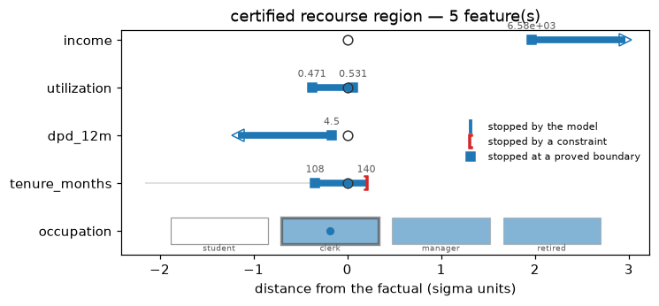
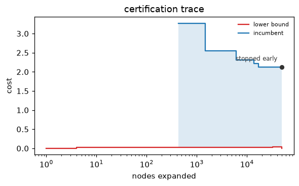

# Certify and widen

!!! info "Shared objects"
    Snippets on this page continue from the objects the [quickstart](../getting-started.md) builds with
    `credit_demo()`: `exp`, `x`, `target`, `X_bg`, the solved `res` and `batch`, and `cal`,
    a fitted monotone calibrator (see the [FAQ](../faq.md#how-do-i-target-a-calibrated-probability)).

The default backend returns a good plan; `backend="exact"` returns a plan
with a *claim* — proved cheapest, cheapest within a stated gap, or certified
impossible — and `region=True` widens a point plan into a certified box.
This page is the workflow; the boundaries of the claims are in
[Certification](../concepts/certification.md).

## Prove optimality

```python
from treecf import Counterfactual, Infeasible

res = exp.explain(x, target=target, backend="exact", seed=0)
if isinstance(res, Counterfactual):
    res.proof   # "optimal" — no cheaper feasible row exists in the searched grid
elif isinstance(res, Infeasible):
    res.proof   # "certified" (nothing exists) or "search_exhausted" (budget ran out)
```

Read `proof`, never just the presence of a row: the exact backend reports
`"heuristic"` honestly when a conservative constraint repair had to withdraw
the optimality claim
([the honesty notes](../concepts/certification.md#two-honesty-notes)).

## Budgets, gap, warnings

Three arguments control how hard the search works, and every degraded
outcome warns rather than passing silently:

- `time_budget_s` (default 10.0) and `node_budget` (default 2,000,000) cut
  the search off; a cut always emits a `TreecfWarning` naming the cause and
  the result downgrades to best-found.
- `gap=0.05` accepts a plan provably within 5% of the optimum, reported as
  `proof="optimal_within_gap"` — usually a large speedup for the last few
  percent of proof.
- `warm_start=True` (default) seeds the search with a short genetic pass; it
  changes speed, never the claim.

Presolve — a reachability filter that discards candidate values no tree can
respond to — runs before every exact search and is reported in
`solver_stats["presolve_removed"]`; when it empties a feature's domain
entirely it certifies infeasibility without expanding a single node
([how presolve works](../concepts/certification.md#presolve-pruning-before-the-search-starts)).

## Refine the search

`search="refine"` (opt-in; the default `"classic"` is unchanged) runs the
exact backend coarse-to-fine. Instead of trying one candidate value per
feature at a time, it first holds each numeric feature to a *range* of
routing cells — at most eight per feature — and only splits a range where
the score bound cannot decide the whole box. A box whose bracket lies inside
the target and whose representative row passes every constraint is accepted
at its true minimum cost without looking inside; everything else is refined
down to the atomic cells the classic search would have visited, and settled
by exactly the same rules. The claim is the same — `proof="optimal"`, a
certified `Infeasible` — and so is the optimal cost; the returned row may be
a different argmin of that cost, and `solver_stats` records `search`,
`coarse_accepts`, and `refinements`:

```python
res = exp.explain(x, target=target, backend="exact", search="refine", seed=0)
res.proof                              # "optimal" — the same claim as the classic search
res.solver_stats["search"]             # "refine"
res.solver_stats["coarse_accepts"]     # boxes accepted whole, without descending into them
res.solver_stats["refinements"]        # ranges split because the bound could not decide them
```

Refine pays off where features carry many thresholds: the [benchmarks
page](../benchmarks/comparison.md) shows both engines side by side on the
same solves. Budgets, `gap`, warm start, and the degradation warnings work
identically in both modes.

## Widen to a region

`region=True` grows a certified box around the plan: per-feature intervals —
and, for categorical features, sets of category codes — within which *every*
row still satisfies the target and constraints:

```python
res = exp.explain(x, target=target, backend="exact", region=True, seed=0)
res.region.feature_intervals    # {"income": (lo, hi), ...} — certified intervals
res.region.feature_categories   # {"occupation": (1, 2)} — certified category codes
```


A side no constraint bounds stops at the observed range of the explainer's
background data (`res.region.data_limited` names those sides), so an
unconstrained feature reads `in [0, 1)` rather than `< 1` over an implicit
minus infinity; add a `Range` where the domain is known.
Regions are sound but not monotone in the target interval, and in the
default fast mode not maximal either —
[the fine print](../concepts/certification.md#regions-certified-not-maximal-not-monotone).
`plot_region` in [visualize](visualize.md) draws the box with what stopped
each bound.

## Prove the boundary

`region_mode="maximal"` (opt-in; the default `"fast"` is unchanged) settles
every side the fast growth stops. Fast mode stops a side as soon as the
conservative interval bound of the enlarged box fails; maximal mode then
asks the sharper question — does the next routing cell on that side contain
*any* point that leaves the target or breaks a constraint? — and answers it
with a budgeted search for such a point. Three outcomes, per side:

- the search completes and finds none: the side extends and keeps growing;
- it finds one: the side is **proved** — recorded in
  `RecourseRegion.maximal` as `(lower proved, upper proved)` per feature and
  in `maximal_categories` per categorical feature — and the point is kept as
  a witness when you ask for it;
- it spends its `region_budget` (search nodes per side, default 100 000):
  the side is left unproven, which is what fast mode reports for every side.

```python
res = exp.explain(
    x, target=target, backend="exact", region=True, region_mode="maximal", seed=0
)
res.region.maximal              # {"income": (True, True), ...} — what each side proved
res.region.describe()           # phrases end in "(maximal)" where every side is proved

proved = exp.recourse_region(x, res.x_cf, target, mode="maximal", keep_witnesses=True)
proved.witnesses                # {"income:hi": point, ...} — one violating point per proved side
```



"Proved" is a precise, local claim: the region cannot be extended into the
next cell on that side without some point leaving the target or breaking a
constraint, given every *other* coordinate ranges over the box as certified.
A different box that also shrinks another feature is not ruled out, and a
maximal region need not contain the fast one — an early extension on one
feature can make a later extension on another genuinely unsound. The
emptiness search reuses the refine engine's machinery because a maximality
claim needs a certificate, not a tighter bound; it can cost up to
`region_budget` nodes per side per feature, each a partial ensemble walk.

## Watch the proof form

Every exact solve records a **certification trace** in
`solver_stats["trace"]`: `(nodes_expanded, incumbent_cost, lower_bound)`
sampled at every incumbent update and every power-of-two node count, plus
one terminal sample, capped at 256 entries. The lower bound is the sound
bound the search holds at that moment; the incumbent is the cheapest row it
has found. `plot_certification_trace` draws the two against the node count:

```python
import warnings

from treecf import TreecfWarning
from treecf.viz import plot_certification_trace

with warnings.catch_warnings():
    warnings.simplefilter("ignore", TreecfWarning)   # a cut-off search warns, by design
    cut = exp.explain(
        x, target=target, backend="exact", seed=0, node_budget=50_000, warm_start=False
    )
plot_certification_trace(cut)   # incumbent stepping down, the bound below it, the outcome named
```



The terminal label is the claim: `optimal`, `within gap`, `certified
infeasible`, or `stopped early` for a search that ran out of budget or
withdrew its claim — the solve-time warning names which.

## Size the search

`Explainer.search_profile(x)` says how large the space a classic search
would enumerate is, before any search runs: per feature, its kind, the
number of atomic routing cells (or category blocks), the number of candidate
values left after the instance bounds, and whether the search branches on it
at all; in total, the number of influential features and `log10_states`, the
exponent of the number of complete assignments. With a target, presolve runs
too and reports the filtered sizes and whether it certifies infeasibility
outright. The budget-exhaustion warning quotes the same figure.

```python
profile = exp.search_profile(x, target)
profile["influential_features"]         # features the search would branch on
profile["log10_states"]                 # 10**this complete assignments, at most
profile["presolve_certified"]           # presolve alone proved the target unreachable?
```

## Next

A proof is only worth what a third party can re-check:
[make it auditable](auditability.md). The search itself was set up in
[run the search](explain.md).
