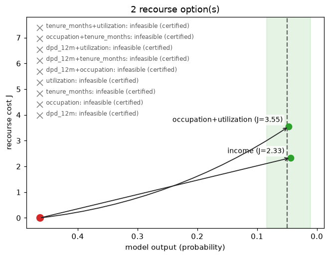

# Visualize

!!! info "Shared objects"
    Snippets on this page continue from the objects the [quickstart](../getting-started.md) builds with
    `credit_demo()`: `exp`, `x`, `target`, `X_bg`, the solved `res` and `batch`, and `cal`,
    a fitted monotone calibrator (see the [FAQ](../faq.md#how-do-i-target-a-calibrated-probability)).

Every plot function in one place, grouped by the question it answers. All of
them live in `treecf.viz` and `treecf.viz_batch` (extra: `treecf[viz]`),
take an optional `ax`/`axes`, and return the matplotlib axes for further
styling. Categorical features are drawn with their display names whenever
`categories=` named them.

## One plan

What changed, and what it does to the score:

```python
from treecf.viz import plot_changes, plot_effort, plot_waterfall

plot_changes(res)                      # the changes, largest first
plot_waterfall(exp, res, target=target)  # per-change score contribution
plot_effort(exp, res)                  # cost per change, in sigma units
```


## Alternatives and ladders

Several plans for the same row, side by side:

```python
from treecf import Target
from treecf.viz import plot_alternatives, plot_ladder, plot_recourse_map, plot_tradeoff

plans = exp.explain_coalitions(
    x, target=target,
    coalitions={"repayment": ["utilization", "dpd_12m"], "income": ["income"]},
    include_full=True, seed=0,
)
plot_alternatives(plans, explainer=exp)   # per-plan changes, one color per plan
plot_tradeoff(plans, target=target)       # what each plan costs and buys
plot_recourse_map(exp, x, plans, target=target)   # model output vs. cost

ladder = exp.explain(x, target=Target.bands({"A": (0.0, 0.01), "B": (0.01, 0.05)}), seed=0)
plot_ladder(ladder)                       # one bar per grade band
```


`plot_recourse_map(..., schematic=True)` drops the numbers for a
presentation-ready sketch of the same geometry:


## A certified region

The certified box from `region=True` — per-feature intervals, category
tiles for categorical features, and a marker for what stopped each bound:
the model, a constraint, or — for a region grown with
`region_mode="maximal"` — a proved boundary (a filled square). The legend's
"certified, not necessarily maximal" line appears only while some side is
neither at a bound nor proved ([prove the boundary](certify.md#prove-the-boundary)):

```python
from treecf.viz import plot_region

certified = exp.explain(x, target=target, backend="exact", region=True, seed=0)
plot_region(exp, x, certified)
```


## A whole campaign

Reading thousands of rows at a glance:

```python
from treecf.viz_batch import (
    plot_batch_deltas, plot_batch_levers, plot_batch_matrix, plot_batch_summary,
)

plot_batch_summary(batch)          # feasibility, cost, and sparsity overview
plot_batch_levers(batch)           # which features do the work, campaign-wide
plot_batch_matrix(batch, explainer=exp)   # rows × features, who changes what
plot_batch_deltas(batch, explainer=exp)   # the distribution of each lever's moves
```


## Recourse burden by segment

Who pays how much for recourse, and for whom none exists — `groups` is any
per-row labeling (a segment column, a protected attribute, a portfolio):

```python
from treecf.viz_batch import plot_recourse_burden, recourse_burden_table

groups = ["thin-file" if row[3] < 24 else "established" for row in X_bg[:20]]
rows = recourse_burden_table(batch, groups, min_group_size=5)
plot_recourse_burden(batch, groups, min_group_size=5)
```


The table reports, per group, the feasible share and the cost distribution
of the feasible plans; the plot draws both panels. A group's low median cost
means nothing without its feasibility rate alongside — the table keeps them
together deliberately.

## A recourse menu

`plot_recourse_menu` draws every lever set a `recourse_menu` solved as one
row of a matrix: a filled cell where the plan changed that lever (shaded by
the size of the change), the plan cost on the row label, and a glyph for
the proof the row carries — a filled square for an optimal plan, a cross for
a set certified unable to reach the target:

```python
from treecf.viz import plot_recourse_map, plot_recourse_menu

menu = exp.recourse_menu(x, target=target, max_levers=2, backend="exact", seed=0)
plot_recourse_menu(menu, explainer=exp)
plot_recourse_map(exp, x, menu, target=target)   # the same menu, as a recourse map
```


A menu is a mapping in the same shape `explain_coalitions` returns, so the
recourse map takes it unchanged — every feasible set becomes one point and
every certified-infeasible set one grey cross:



Where the menu comes from, and what `complete` certifies:
[Run the search](explain.md#recourse-menus-and-diverse-plans).

## Comparing multiple counterfactuals

`plot_counterfactuals` overlays any list of plans for one factual:

```python
from treecf.viz import plot_counterfactuals

second = exp.explain(x, target=target, seed=1)
plot_counterfactuals([res, second])
```


## Related

- [Certify and widen](certify.md): where the region being drawn comes from.
- [Run the search](explain.md): producing the batches these plots read.
