# Visualize

Every plot function in one place, grouped by the question it answers. All of
them live in `treecf.viz` and `treecf.viz_batch` (extra: `treecf[viz]`),
take an optional `ax`/`axes`, and return the matplotlib axes for further
styling. Categorical features are drawn with their display names whenever
`categories=` named them.

## One plan

What changed, and what it does to the score:

```python
# exp, res, target: the docs explainer, its solved plan, and the target
from treecf.viz import plot_changes, plot_effort, plot_waterfall

plot_changes(res)                      # the changes, largest first
plot_waterfall(exp, res, target=target)  # per-change score contribution
plot_effort(exp, res)                  # cost per change, in sigma units
```

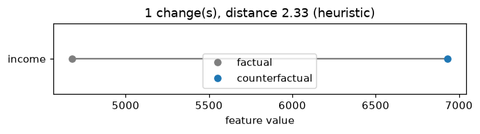

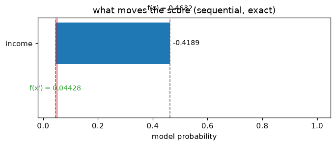

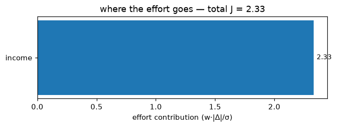

## Alternatives and ladders

Several plans for the same row, side by side:

```python
# exp, x, target: the docs explainer, one rejected applicant, the target
from treecf import Target
from treecf.viz import plot_alternatives, plot_ladder, plot_recourse_map, plot_tradeoff

plans = exp.explain_coalitions(
    x, target=target,
    coalitions={"repayment": ["utilization", "dpd_12m"], "income": ["income"]},
    include_full=True, seed=0,
)
plot_alternatives(plans, explainer=exp)   # per-plan changes, one color per plan
plot_tradeoff(plans, target=target)       # what each plan costs and buys
plot_recourse_map(exp, x, plans, target=target)   # model output vs. cost

ladder = exp.explain(x, target=Target.bands({"A": (0.0, 0.01), "B": (0.01, 0.05)}), seed=0)
plot_ladder(ladder)                       # one bar per grade band
```

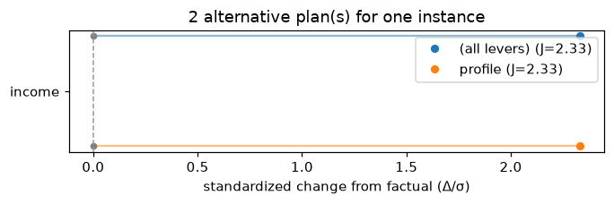

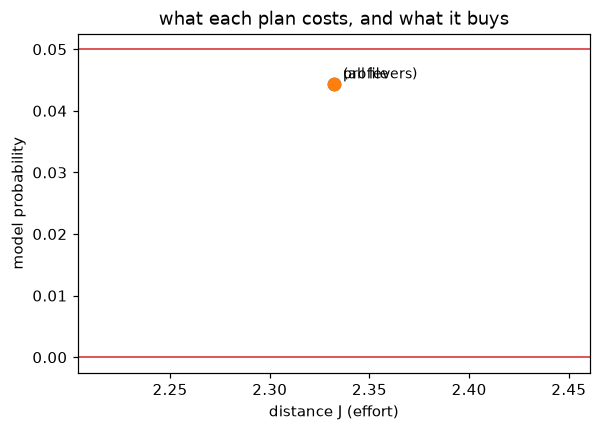

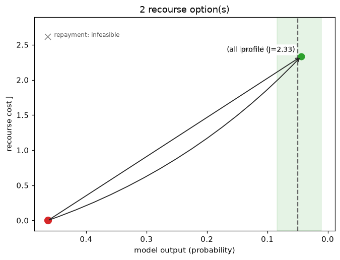

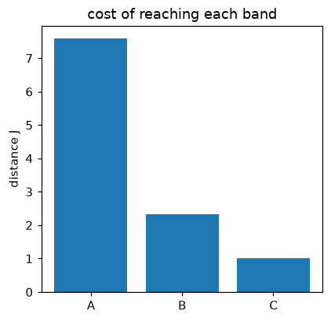

`plot_recourse_map(..., schematic=True)` drops the numbers for a
presentation-ready sketch of the same geometry:

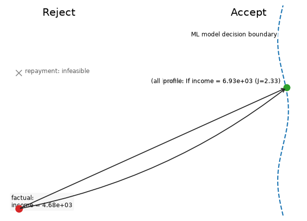

## A certified region

The certified box from `region=True` — per-feature intervals, category
tiles for categorical features, and a marker for what stopped each bound
(the model or a constraint):

```python
# exp, x, target: the docs explainer, one rejected applicant, the target
from treecf.viz import plot_region

certified = exp.explain(x, target=target, backend="exact", region=True, seed=0)
plot_region(exp, x, certified)
```

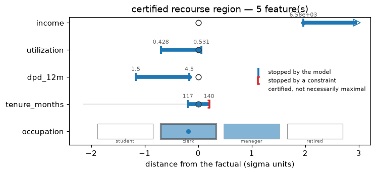

## A whole campaign

Reading thousands of rows at a glance:

```python
# exp, batch: the docs explainer and its solved batch
from treecf.viz_batch import (
    plot_batch_deltas, plot_batch_levers, plot_batch_matrix, plot_batch_summary,
)

plot_batch_summary(batch)          # feasibility, cost, and sparsity overview
plot_batch_levers(batch)           # which features do the work, campaign-wide
plot_batch_matrix(batch, explainer=exp)   # rows × features, who changes what
plot_batch_deltas(batch, explainer=exp)   # the distribution of each lever's moves
```

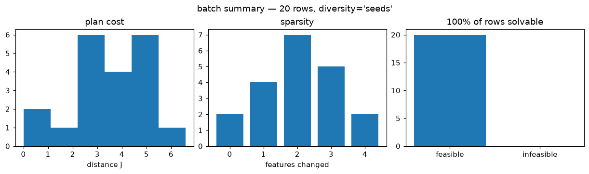

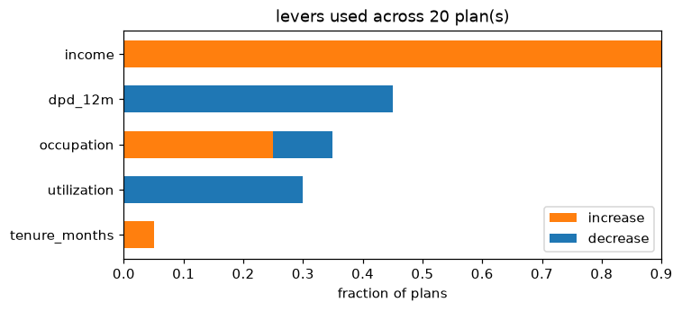

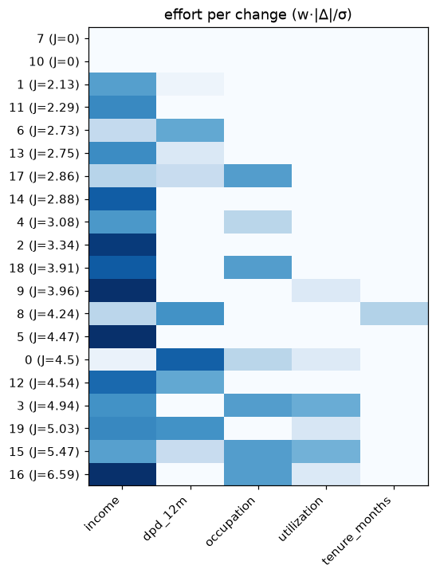

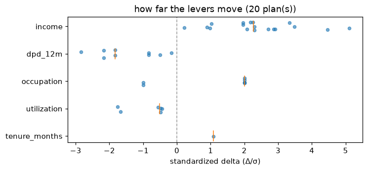

## Recourse burden by segment

Who pays how much for recourse, and for whom none exists — `groups` is any
per-row labeling (a segment column, a protected attribute, a portfolio):

```python
# exp, X_bg, batch: the docs explainer, its background rows, its solved batch
from treecf.viz_batch import plot_recourse_burden, recourse_burden_table

groups = ["thin-file" if row[3] < 24 else "established" for row in X_bg[:20]]
rows = recourse_burden_table(batch, groups, min_group_size=5)
plot_recourse_burden(batch, groups, min_group_size=5)
```

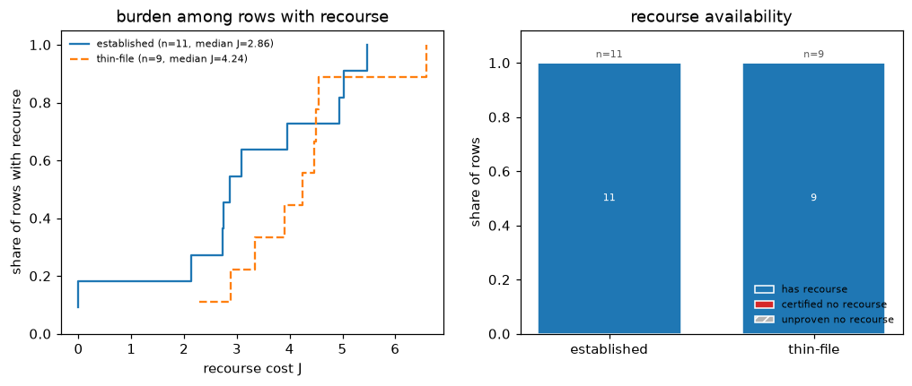

The table reports, per group, the feasible share and the cost distribution
of the feasible plans; the plot draws both panels. A group's low median cost
means nothing without its feasibility rate alongside — the table keeps them
together deliberately.

## Comparing multiple counterfactuals

`plot_counterfactuals` overlays any list of plans for one factual:

```python
# exp, x, res, target: the docs explainer, applicant, plan, and target
from treecf.viz import plot_counterfactuals

second = exp.explain(x, target=target, seed=1)
plot_counterfactuals([res, second])
```

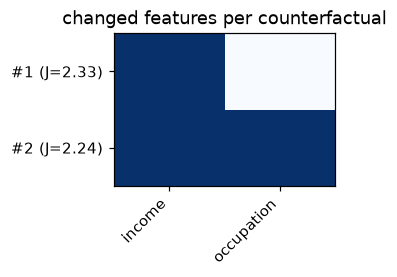

## Related

- [Certify and widen](certify.md): where the region being drawn comes from.
- [Run the search](explain.md): producing the batches these plots read.
