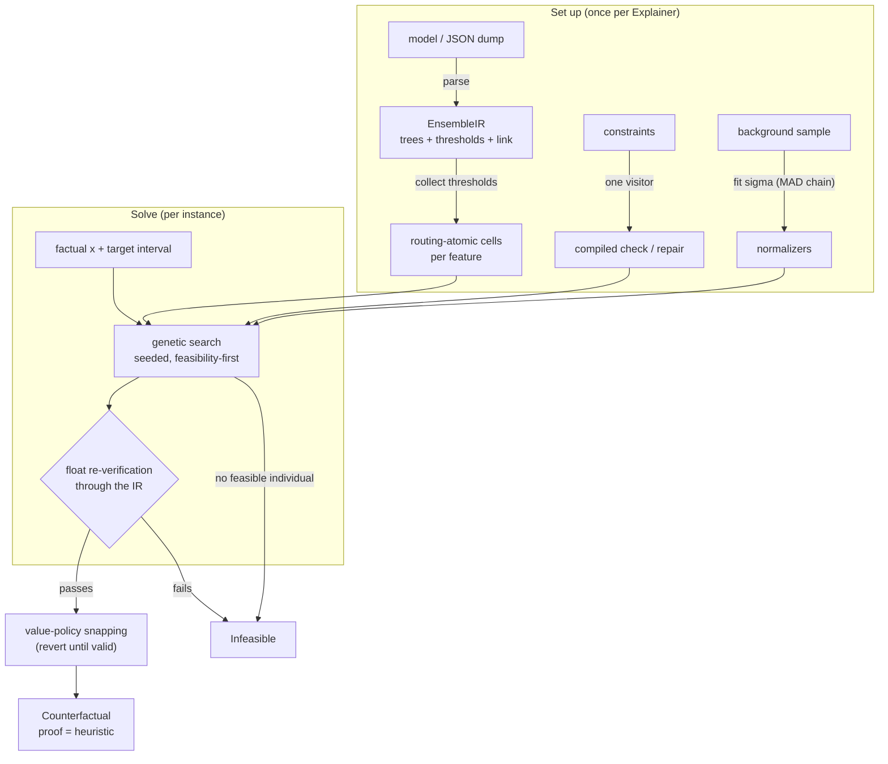
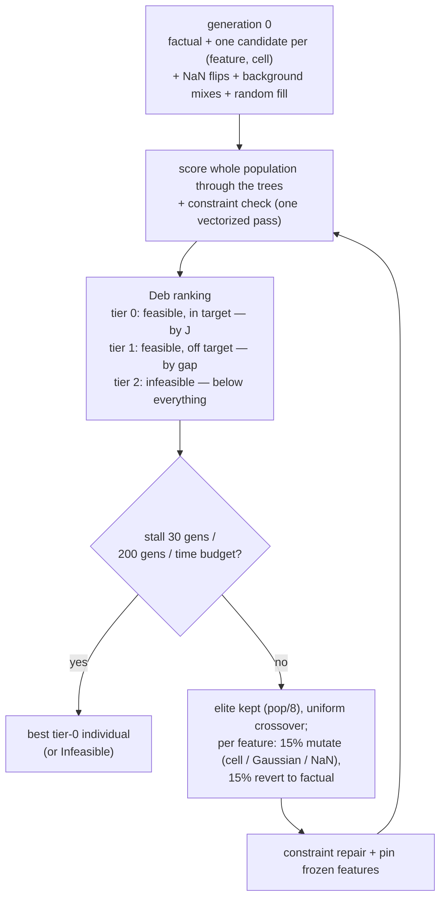

# How treecf finds counterfactuals

A counterfactual explanation answers one question: *what is the smallest realistic change to
this instance that moves the model's output into a target range?* treecf's promise is that the
answer is never a guess — every returned counterfactual has been re-scored against the model in
float space and checked against every constraint before you see it.

This article walks the whole pipeline for one instance: how the question is turned into a
precise objective, why the search runs over a finite grid of model behaviors rather than over
real numbers, how constraints and plausibility enter, what the genetic search actually does, and
what happens between "the search found something" and "you get a `Counterfactual`". Each stage
links to a concept page that covers it in depth.

!!! example "Running example"
    A credit applicant is declined: the model puts their probability of default at 0.62,
    and the policy approves below **PD 0.30**. The features include `income_monthly`,
    `utilization`, `max_dpd_30d`, `max_dpd_12m`, `months_since_last_delinq` (NaN when there
    is no delinquency record), and `age` — which the bank has frozen: no recourse plan may
    ask an applicant to be younger. The question for treecf: *what is the cheapest realistic
    set of changes that brings this applicant under the cutoff?*

The pipeline, end to end — every stage below gets its own section:



## The question, stated precisely

"Smallest realistic change" becomes an optimization problem. Given the factual instance
$x$, treecf searches for $x'$ minimizing

$$
J(x') \;=\; \sum_{j\,:\,x'_j \neq x_j} w_j \, \frac{d_j(x_j, x'_j)}{\sigma_j}
\;+\; \lambda \, \bigl\lVert x' - x \bigr\rVert_0
$$

subject to the model's raw score landing in the target interval, $L \le S(x') \le U$, and every
constraint holding. The first term prices *how far* each feature moves; the second prices *how
many* features move at all — the sparsity weight $\lambda$ is why treecf plans tend to touch two
or three levers instead of nudging everything a little.

### Normalizers

Raw feature deltas are incomparable — 500 units of `income_monthly` is a rounding error, 0.5 of
`utilization` is half the scale. Each feature's delta is divided by a robust scale $\sigma_j$
fitted from a background sample: **MAD, falling back to IQR, then range, then 1.0** with a
warning. The chain matters in credit data, where features like DPD counts have a point
mass at zero and `median = mode = 0` makes the MAD degenerate. You can override any $\sigma_j$
and add per-feature weights $w_j$ — in the tutorials, `income_monthly` gets $w = 2$ because
income is genuinely hard to change.

### Targets

The target is always an **interval on the raw score**. `Target.probability(range=(0.0, 0.30))`
on a sigmoid-link model is converted through the logit into raw-score bounds once, so the search
itself never evaluates a sigmoid. Rating "bands" (one plan per grade) are just several intervals
solved one after another. See [Targets](concepts/targets.md).

??? note "How NaN transitions are priced"
    A plan may set `months_since_last_delinq` to NaN (the record ages out) or fill a missing
    value in — but only where an `AllowMissing` constraint permits it, and the distance for
    that transition is the constraint's explicit `delta_miss`. There is deliberately
    no default: a MAD-based price for "value becomes missing" would be meaningless. See
    [Missing values](concepts/missing-values.md).

## One model language: the IR

treecf never touches your model object during the search. XGBoost, LightGBM, CatBoost, and
scikit-learn models — native objects or JSON dumps — are first parsed into one intermediate
representation, `EnsembleIR`: flat trees whose nodes store `(feature, threshold, op,
missing_left)` exactly as the library stores them, plus a base score and a link function. The
raw score is always $S(x) = \text{base\_score} + \sum_t \text{leaf}_t(x)$. Everything downstream
— cells, the genetic engines, verification — speaks only IR, which is why a JSON dump on an
audit host with no xgboost installed explains identically to the native object. See
[Models and the IR](concepts/models.md).

```python
from treecf import Explainer, Freeze, Target, constraint

exp = Explainer(
    model,                     # native object, JSON dump path, or EnsembleIR
    background=X_train,        # fits the sigma_j normalizers
    constraints=[Freeze("age"), constraint("max_dpd_30d <= max_dpd_12m")],
)
```

!!! warning "No LT/LE normalization"
    Libraries disagree on whether a split means `v < t` or `v <= t`. A tempting trick is to
    rewrite one into the other by shifting the threshold one float away (`nextafter`). treecf
    forbids this: the shifted threshold is a *different model* at exactly the values
    counterfactuals love — points sitting right at a threshold. Every node keeps its native
    operator, and the parsers are conformance-tested against the source library on thousands
    of probes, including NaN and threshold-adjacent values.

## The search space: cells, not real numbers

A tree ensemble is a piecewise-constant function. For any single feature, collect every
threshold any tree splits on: those thresholds cut the real line into a finite set of
**routing-atomic cells** — intervals inside which *every tree routes identically*.
Between two adjacent thresholds, moving the feature changes nothing about the model's output;
only crossing a threshold does.

This turns an intractable search over $\mathbb{R}^p$ into a search over a finite grid of
*behaviors*. For the declined applicant, the model does not care whether `utilization` becomes
0.41 or 0.38 — it cares which side of the 0.42 split the value lands on. And within a chosen
cell there is exactly one optimal value: **the point of the cell nearest to the factual value**,
since any deeper move costs more distance and changes nothing.

One subtlety earns its own rule. When the nearest point of a cell is an open bound — "strictly
below 0.42" — treecf steps **one float32 ulp** inside the bound, not one float64 ulp.

??? note "Why float32, not float64"
    Gradient-boosting libraries compare feature values against thresholds in float32. A
    float64 value one float64-ulp below a threshold *is the threshold* after the float32
    cast, and the deployed model routes it the other way — the counterfactual would flip in
    production while verifying cleanly in treecf's float64 IR. Stepping a float32 ulp keeps
    the returned value on the correct side in the model as deployed, with a float64-ulp
    fallback for cells narrower than a float32 ulp.

## Constraints compile once, apply everywhere

Realism comes from constraints: `Freeze("age")`, `Monotone("max_dpd_12m", "decrease")`,
`Range`, `Equals`, `OneHot` for exploded categoricals, `Implies`, linear relations written as
strings — `constraint("max_dpd_30d <= max_dpd_12m")`. Each constraint object is compiled
**once, by a single visitor**, into two synchronized artifacts:

- an abstract constraint form (the MILP-safe subset — integer/bool variables, linear
  inequalities, half-reified implications), and
- a vectorized **check / repair** pair the genetic engines run every generation: `check`
  answers "does this candidate satisfy the constraint", `repair` moves a violating candidate
  to a nearby satisfying one (clipping into ranges, re-normalizing a one-hot group, assigning
  an implied value).

One compiler means one semantics: there is no way for a constraint to mean one thing in a check
and another in a repair, because both are generated from the same visit. See
[Constraints](concepts/constraints.md) — including `suggest_constraints`, which mines candidate
invariants from your data instead of making you enumerate them.

### Plausibility is just another constraint

Feasible is not the same as *believable*: a plan can satisfy every declared rule and still land
in a region where no real applicant lives. Optionally, treecf bounds an isolation forest's
anomaly score: the forest is parsed through the **same IR** (leaf value = depth-adjusted path
length), and the requirement $s(x') \le \theta$ is algebraically equivalent to one linear bound
on the summed path lengths:

$$
\sum_{t=1}^{T} h_t(x') \;\ge\; -\,T \cdot c(n) \cdot \log_2 \theta .
$$

To the search this is simply one more feasibility test, evaluated by the same tree-scoring code
as the model itself. See [Plausibility](concepts/plausibility.md).

## The genetic search

With the objective, the cells, and the compiled constraints in hand, the search itself is a
seeded, constraint-aware genetic algorithm. The default engine is a Rust core bundled in
the wheel; `backend="python"` runs the numpy reference implementation of the same algorithm.
[Backends and proofs](concepts/backends.md) summarizes the contract; here is the mechanism.



### A smart first generation

The GA does not start from noise. Generation zero contains:

- the factual instance itself (a free feasibility probe),
- **one candidate per (feature, cell) pair** — every single-feature move the model can
  distinguish, each placed at the cell's nearest-to-factual point,
- a NaN flip for every feature `AllowMissing` permits,
- up to 20 crossovers between the factual and rows of the background sample — real applicants
  donate realistic joint values,
- random multi-feature perturbations to fill the population (default 80).

For many instances the answer — or something within a mutation of it — is already present in
generation zero; the loop's job is to refine and sparsify it.

### Feasibility first

Ranking uses Deb's feasibility-first rules. Every candidate is scored in one vectorized pass
(the whole population through the trees at once), checked against the constraints, and placed
in a tier:

| tier | meaning | ranked by |
|---|---|---|
| 0 | feasible **and** score in the target interval | objective $J$ |
| 1 | feasible, score off-target | gap to the target interval |
| 2 | violates a constraint | pushed below everything feasible |

Any feasible candidate outranks every infeasible one — the search cannot trade a constraint
violation for a better distance. The plausibility bound, when present, is folded into the same
feasibility test.

### Operators that drive sparsity

Each generation keeps an elite (population/8), then breeds children by uniform crossover
between parents drawn from the better half. Each mutable feature of a child then rolls:

- **15%** — mutate: jump to a random cell value, take a Gaussian step scaled by $\sigma_j$, or
  (where allowed) flip to NaN;
- a further **15%** — **revert to the factual value**.

That revert mutation is the explicit $\lambda$-pressure in the operators: plans are constantly
tempted to un-change features, so a change only survives generations if it earns its place in
the score. After breeding, every child is passed through constraint `repair` and frozen
features are pinned back — the population never drifts away from the rules.

### Knowing when to stop

The loop ends at whichever comes first: no improvement of the best feasible objective for 30
generations (the usual exit), 200 generations, or the per-solve `time_budget_s`. The best
tier-0 individual wins.

!!! info "Heuristic, but bracketed"
    Results carry `proof="heuristic"` — the search does not prove optimality, and
    `Infeasible` from it means "search exhausted", not "no solution exists". In treecf's
    test suite a brute-force oracle brackets the GA on small models, and early development
    versions carried an exact CP-SAT backend whose removal is documented in
    [Backends — history](concepts/backends.md#history). If you need provable optimality,
    pair the IR with a dedicated exact solver.

## Nothing ships unverified

The GA's winner is a candidate, not yet an answer. Before anything is returned, treecf
re-verifies it **in float space through the IR**: the raw score is recomputed and
checked against the target interval, every feature against its instance bounds, NaN placement
against `AllowMissing`, every linear constraint, `Implies`, and `OneHot` re-evaluated, and the
plausibility score re-computed. A candidate that fails any check becomes `Infeasible` — an
invalid counterfactual is never returned.

Value policies run inside the same safety net. If you declare
`value_policy={"n_active_loans": "integer"}` or a `Grid(step=50)` for income, the verified plan
is snapped to conforming values *within their cells*; if snapping breaks validity, snaps are
reverted one at a time until the plan verifies again. What you get back is honest about it:

```python
res = exp.explain(applicant, target=Target.probability(range=(0.0, 0.30)), seed=0)
res.proof        # "heuristic"
res.score_prob   # 0.29…  — recomputed, in target
res.changes      # {"utilization": (0.71, 0.419…), "max_dpd_12m": (9.0, 3.0)}
res.snapped      # which value policies actually applied
```

## Two engines, one behavior; one row or ten thousand

Both engines — the Rust default and the numpy reference — share the IR, the compiled
constraints, and the algorithm above; they are seed-deterministic and held to statistical
parity, and the Rust core is bitwise-identical on tree evaluation and constraint check/repair
(the speed difference is documented in [Backends — performance](concepts/backends.md#performance)).

Batch production builds directly on the same machinery. `explain_batch` derives an independent
seed per (row, attempt) and hands whole *waves* of searches to the Rust core in one call, which
fans them out across cores; because every task is independently seeded, the records are
identical to running the rows one by one in a Python loop. One caveat: `time_budget_s` remains
a per-solve wall-clock budget, and concurrent solves share cores — a solve that actually hits
its budget under contention may stop a generation earlier than it would alone. Stall and
max-generation stops, the common case, are deterministic. The
[credit-risk walkthrough](notebooks/02-credit-risk-tutorial.ipynb) mass-produces a day of
recourse plans this way and visualizes the batch.

## Grouped recourse: coalitions

Everything above optimizes one global plan — the cheapest feasible change-set, wherever the
levers happen to live. Sometimes that is the wrong shape for advice: a plan that asks the
declined applicant to raise `income_monthly`, cut `utilization`, *and* wait out a delinquency
mixes three different life projects into one instruction.

The opt-in **coalitions mode** runs the very same pipeline once per named feature group, with
every feature outside the group frozen — freezing is already a constraint the compiler and
verifier understand, so no new search semantics are involved. For the running example:

```python
result = exp.explain_coalitions(
    applicant, target=Target.probability(range=(0.0, 0.30)),
    coalitions={
        "debt history": ["max_dpd_30d", "max_dpd_12m", "months_since_last_delinq"],
        "credit usage": ["utilization", "n_active_loans", "n_loans_total"],
        "income":       ["income_monthly"],
    },
    include_full=True, seed=0,
)
```

Each group answers its own question. A `Counterfactual` for `"debt history"` is a plan the
applicant can execute on that front alone; an `Infeasible` for `"income"` is the finding that
no realistic income change reaches the cutoff by itself — a hint a single mixed plan would
have buried. The `"(all levers)"` baseline anchors the comparison: how much does restricting
to one group cost relative to the unrestricted optimum? Verification is unchanged — every
coalition plan is float-verified against that coalition's constraint set before it is
returned. In batch mode (`explain_batch(..., diversity="coalitions")`) each coalition's rows
solve as one parallel Rust wave.

[Coalitions](concepts/coalitions.md) covers the semantics (overlaps, uncovered features, the
reserved baseline name) and the comparison plots.

## Where to go next

- [Models and the IR](concepts/models.md) — supported libraries, score semantics, parser
  pitfalls.
- [Targets](concepts/targets.md) — probability vs raw targets, rating bands.
- [Constraints](concepts/constraints.md) — the constraint objects, string sugar, and mining.
- [Missing values](concepts/missing-values.md) — NaN as a first-class value.
- [Plausibility](concepts/plausibility.md) — the isolation-forest bound.
- [Coalitions](concepts/coalitions.md) — grouped recourse, one plan per feature group.
- [Backends and proofs](concepts/backends.md) — engine contract and history.
- Tutorials: [Quickstart](notebooks/01-quickstart.ipynb), the
  [credit-risk walkthrough](notebooks/02-credit-risk-tutorial.ipynb), and
  [no-solver environments](notebooks/03-no-solver-environments.ipynb).
- [API reference](api.md).
