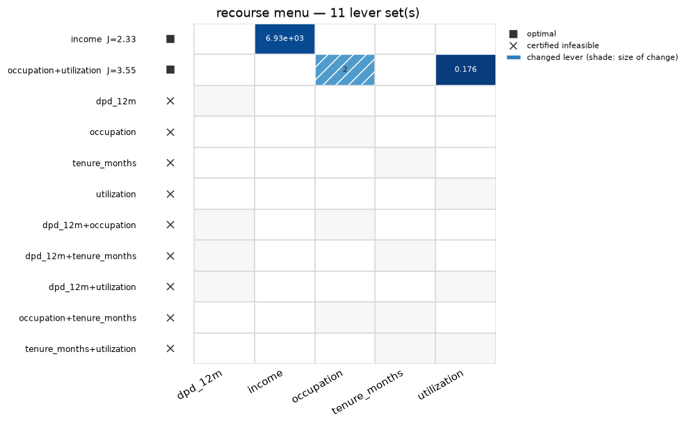

# treecf

**Constrained, threshold-aware counterfactual explanations for tree ensembles.**

`treecf` answers: *"what is the minimal, feasible change to this instance such that the
model's output lands in a target interval?"* — for XGBoost, LightGBM, CatBoost and
scikit-learn tree ensembles — and can prove the answer is the cheapest, or that none exists.

```python
from treecf import Explainer, Target
from treecf.datasets import credit_demo   # a packaged model, background rows, one declined row

model, X, x = credit_demo()
exp = Explainer(model, background=X)
res = exp.explain(x, target=Target.probability(range=(0.0, 0.05)), seed=0)
res.changes   # {'income': (4678.0, 6932.4)}
```



## Why treecf

- **Tree-native and fast.** Models parse into one tree IR and the search runs on a bundled
  Rust core, typically in milliseconds on 300-tree ensembles; every result is float-verified
  against the parsed model, and the parsers are conformance-tested against the native
  library ([how it works](how-it-works.md)).
- **Proofs, inside a measured envelope.** `backend="exact"` returns `proof="optimal"` under
  the declared objective, a certified infeasibility, or a certified recourse region — a box
  every point of which is verified — with no external solver. Proofs scale with the levers
  the search may move, not the model's width: wide models certify once the levers are
  restricted, and a search that runs out of budget says so
  ([the proof envelope](concepts/certification.md#the-proof-envelope-measured)).
- **Declarative constraints.** `Freeze`, `Monotone`, `Range`, `OneHot`, and linear rules
  such as `max_dpd_30d <= max_dpd_12m`, compiled once for every engine
  ([constraints](concepts/constraints.md)).
- **Auditable output.** A self-contained JSON certificate a validator re-checks with
  `check_certificate` years later, and a one-page portfolio report for a whole campaign
  ([auditability](guide/auditability.md)).

On a 120-tree model and 100 declined rows, treecf's plans cost a seventh of DiCE's at a fifth
of the time; NICE is four times faster per instance and its plans cost 2.7 times more. The
measured tables and the honest reading are on the
[benchmarks page](concepts/backends.md#against-other-cf-libraries).

Use it if your model is a tree ensemble and you need plans that are feasible under real
constraints, cheap, and provable. Look elsewhere if the model is not a tree ensemble, or
if you want sets of plans diverse by distance rather than by the levers they use.

Also in the box: missing values as first-class counterfactual values, plausibility as a
hard constraint, batch production, coalitions, native categorical features, the probcal
calibration integration, the refine search, the maximal region mode, the certification
trace, the portfolio report, and certified recourse menus — all reached from the
[guide](guide/models.md).

## Where to start

1. [Getting started](getting-started.md) — install and your first counterfactual in five
   minutes.
2. [Tutorials](notebooks/01-quickstart.ipynb) — runnable notebooks, from quickstart to a
   credit-risk batch workflow.
3. [Deep dive: how it works](how-it-works.md) — the full pipeline, from objective to
   verified answer.

Contributions are welcome — see
[CONTRIBUTING.md](https://github.com/wlazlod/treecf/blob/main/CONTRIBUTING.md);
security reports go through
[SECURITY.md](https://github.com/wlazlod/treecf/blob/main/SECURITY.md).
